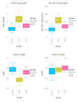

.. MolecBio documentation master file, created by
   sphinx-quickstart on Sun Sep 20 08:21:57 2020.
   You can adapt this file completely to your liking, but it should at least
   contain the root `toctree` directive.

MolecBio.jl documentation
=====================================
A simple Julia utility to automate relative quantification of mRNA from thermocycler cycle threshold (ct) data. Takes as input raw ct values for target and reference genes from experiment and control conditions and returns as output the fold changes in gene expression using the |Dgr| |Dgr| ct method. 

Installation::

   $ julia -e  'using Pkg; pkg"add https://github.com/pkmklong/MolecBio.jl";'
    
    
Entry point::

   $ julia runner.jl --h
   usage: runner.jl -f FILE_PATH -c CONTROL -t TARGET -n NORMALIZER [-h]

   optional arguments:
     -f, --file_path FILE_PATH
                           The path to raw ct data (csv) for relative RNA
                           quantification
     -c, --control CONTROL
                           The name of your control group (default:
                           "control")
     -t, --target TARGET   The name of your target transcript
     -n, --normalizer NORMALIZER
                           The name of your normalizing reference
                           transcript
     -h, --help            show this help message and exit

Input data dictionary::

      {column:                            type      description}
      "group":                            String    Names of comparison groups
      user defined target column:         Float64   ct values of target transcript
      user defined normalizing column:    Float64   ct values of normalizing reference transcript

Fold change:

   
  
Demo::

      $ julia src/runner.jl -f "data/demo_data.csv" -c "control" -t "egf1r" -n "rpl19" 
      Parsed args:
        normalizer  =>  rpl19
        target  =>  egf1r
        control  =>  control
        file_path  =>  data/demo_data.csv
      ┌ Info: Loading CT values table
      └   args["file_path"] = "data/demo_data.csv"
      ┌ Info: Computing fold change with delta delta ct
      │   first(ddct_table, 5) =
      │    5×6 DataFrame
      │    │ Row │ group   │ egf1r   │ rpl19   │ delta_ct │ delta_delta_ct │ fold_change │
      │    │     │ String  │ Float64 │ Float64 │ Float64  │ Float64        │ Float64     │
      │    ├─────┼─────────┼─────────┼─────────┼──────────┼────────────────┼─────────────┤
      │    │ 1   │ control │ 25.6    │ 17.5    │ -8.1     │ 0.4665         │ 1.38175     │
      │    │ 2   │ control │ 25.8    │ 16.9    │ -8.9     │ -0.3335        │ 0.793609    │
      │    │ 3   │ control │ 26.0    │ 17.4    │ -8.6     │ -0.0335        │ 0.977047    │
      │    │ 4   │ control │ 25.4    │ 17.7    │ -7.7     │ 0.8665         │ 1.82323     │
      └    │ 5   │ control │ 25.45   │ 17.2    │ -8.25    │ 0.3165         │ 1.24531     │
      ┌ Info: Saving output table to 
      └   ddct_table_path = "data/demo_data_processed.csv"
      ┌ Info: Saving output figure to 
      └   ddct_figure_path = "data/demo_data_processed.svg"

  
  
.. note::
    Currently assumes perfect amplification efficiency and unpaired samples.
    
    
.. include:: isogrk1.txt

.. toctree::
   :maxdepth: 2
   :caption: Contents:
   
   license

Indices and tables
==================

* :ref:`genindex`
* :ref:`modindex`
* :ref:`search`
